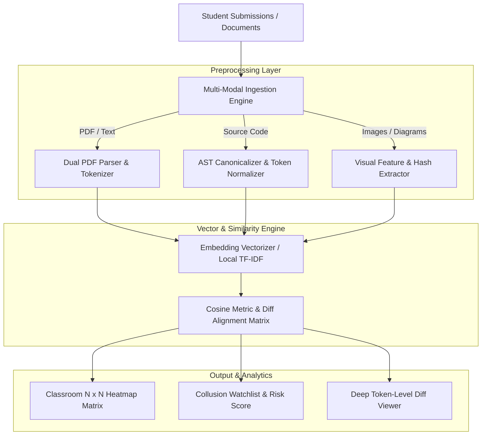

# OriginaX AI — Multi-Modal Plagiarism Detector & Similarity Analysis Framework

> **AI Tools to Detect Plagiarism Beyond Text: A Multi-Modal Similarity Analysis Framework**  
> An advanced academic and enterprise framework engineered to detect plagiarism, collusion, and structural derivation across multiple modalities: **Text Documents, Research PDFs, Source Code, and Visual Diagrams**.

---

## 🌟 Key Highlights

- **📑 Multi-Modal Document & Code Ingestion**
  - **Text & PDF:** Dual-engine extraction pipeline utilizing `pdf2json` and `pdf-parse` to handle complex multi-page academic papers, assignments, and slides.
  - **Source Code Analysis:** Syntax-aware tokenization, comment and whitespace stripping, identifier normalization (`<ID>`, `<NUM>`), and control-flow structural alignment.
  - **Diagrams & Visual Media:** Visual similarity profiling, perceptual hashing, and dimensional feature extraction.

- **🎓 Classroom Batch Mode & Peer Collusion Detection**
  - **$N \times N$ Pairwise Matrix:** Evaluates entire cohorts of student submissions in $O(N)$ vector extraction and $O(N^2)$ cross-matching.
  - **Interactive Heatmap:** Visual matrix view with self-match indicators (`100% (Self)`) and color-coded collusion intensity.
  - **Collusion Watchlist:** Automatically ranks suspicious student pairs exceeding risk thresholds with one-click deep diff inspection.
  - **Persistent History:** Full classroom batch history with instant recall and matrix reconstruction.

- **🔍 Synchronized Diff & Similarity Analysis**
  - Side-by-side split and unified diff viewers with line and token-level highlighted segments.
  - Dynamic similarity meter gauges with clear risk verdicts (Low, Moderate, High, Severe Collusion).

- **⚡ Hybrid AI Architecture (Zero-Config Fallback)**
  - Local cosine similarity and TF-IDF/AST vectorizers run out-of-the-box with **zero external API keys required**.
  - Pluggable AI Gateway ready for HuggingFace embeddings (`all-MiniLM-L6-v2`) and OpenAI models via environment configuration.

- **🛡️ Enterprise Administration Console (Zero-Knowledge Privacy)**
  - **Zero-Knowledge Isolation:** Mathematical data privacy ensures administrators cannot view student document text, raw bodies, or uploaded filenames. All scans are monitored exclusively via salted SHA-256 `task_uuid`s.
  - **Dynamic Multimodal Calibrator:** Real-time slider controls to fine-tune system-wide weights across Text ($W_{\text{text}}$), Code AST ($W_{\text{code}}$), and Diagram ($W_{\text{diag}}$) heuristics.
  - **Model & Key Vault:** Masked credentials and live roundtrip ping testing for OpenAI, Anthropic Claude, Google Gemini, DeepSeek, Grok, HuggingFace, Qdrant, and Milvus.
  - **Full Dual-Theme Engine:** Seamless Light Mode (atmospheric pastel frosted glass) and Dark Mode (deep night nebula canvas) with persistent preference memory.
  - **Monetization & Headless CMS:** Multi-merchant billing (Stripe, Lemon Squeezy, SSLCommerz), subscription tier quota management, and broadcast announcement banners.

---

## 🏗️ System Architecture



---

## 📁 Repository Structure

```
d:/Multi Model Plagiarism Detector/
├── app/
│   ├── api/
│   │   ├── batch-compare/      # Multi-student batch comparison & matrix generation
│   │   ├── batches/            # Dynamic batch history & matrix reload
│   │   ├── compare/            # Pairwise 1-on-1 comparison runner
│   │   ├── jobs/               # Background task queue & recent runs
│   │   ├── report/             # Detailed comparison report data
│   │   └── upload/             # Multi-modal file upload handler
│   ├── dashboard/              # Main instructor dashboard
│   ├── report/[jobId]/         # In-depth side-by-side report inspector
│   └── globals.css             # Tailwind & design system theme
├── components/
│   ├── ClassroomMatrixView.tsx # N x N interactive heatmap & collusion watchlist
│   ├── UploadDashboard.tsx     # Ingestion dashboard with multi-modal tabs
│   ├── RecentJobsTable.tsx     # History tabs (Classroom Batches vs Pairwise)
│   ├── DiffViewer.tsx          # Split / unified code & text diff inspector
│   ├── SimilarityGauge.tsx     # Circular SVG gauge meter
│   └── ReportSummary.tsx       # Overall verdict, risk indicators, & metrics
├── lib/
│   ├── preprocessing/          # Modality-specific extractors (text, code, image)
│   ├── similarity/             # Cosine similarity, scoring formulas, & diffing
│   ├── queue/                  # Job processing orchestration
│   ├── ai-gateway/             # AI embedding gateway with local fallbacks
│   └── prisma.ts               # Prisma database singleton
├── prisma/
│   ├── schema.prisma           # Active SQLite database schema
│   └── schema.mysql.prisma     # Production MySQL schema alternative
└── public/
    └── uploads/                # Runtime upload directory
```

---

## 🚀 Getting Started

### 1. Prerequisites
- **Node.js** v18.17.0 or higher
- **npm** or **yarn** / **pnpm**

### 2. Installation

```bash
# Clone the repository
git clone https://github.com/b19szn/OrginaX.git
cd OrginaX

# Install project dependencies
npm install
```

### 3. Environment Configuration

Copy the example environment template:

```bash
cp .env.example .env
```

The application is pre-configured with local zero-config SQLite (`DATABASE_URL="file:./dev.db"`). Optional AI keys (`HUGGINGFACE_API_KEY`, `OPENAI_API_KEY`) can be provided if cloud embeddings are desired.

### 4. Database Setup

Generate the Prisma client and sync the database schema:

```bash
npx prisma generate
npx prisma db push
```

### 5. Run Development Server

```bash
npm run dev
```

Open [http://localhost:3000](http://localhost:3000) or [http://localhost:3001](http://localhost:3001) in your browser to access the dashboard.

---

## 🧪 Modalities Supported

| Modality | Formats | Processing Method |
| :--- | :--- | :--- |
| **Academic Text / Documents** | `.pdf`, `.txt`, `.md`, `.doc` | Dual PDF stream parsing, sentence n-gram tokenization, TF-IDF cosine distance |
| **Source Code** | `.py`, `.js`, `.ts`, `.java`, `.cpp`, `.c` | Lexical stripping, token anonymization (`<ID>`, `<NUM>`), syntax diff alignment |
| **Diagrams & Visuals** | `.png`, `.jpg`, `.jpeg`, `.webp` | Spatial resolution hashing, perceptual byte distribution analysis |

---

## 📄 License
This project is developed for academic research and educational evaluation purposes.
