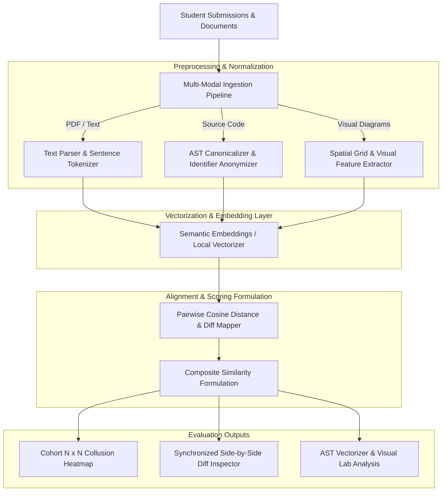

# OriginaX: Multi-Modal Similarity Analysis Framework for Academic Integrity

> **Academic Thesis Project**  
> **Topic:** AI-Assisted Multi-Modal Plagiarism Detection Beyond Text  
> **Domain:** Natural Language Processing, Program Analysis, and Computer Vision  

---

## 1. Abstract & Motivation

Traditional academic integrity tools (e.g., Turnitin, MOSS, JPlag) operate primarily in isolated, single-modal contexts. While conventional systems excel at lexical string matching or tokenized syntax comparisons, they remain vulnerable to:
1. **Identifier Obfuscation and Control-Flow Restructuring** in programming assignments.
2. **Deep Semantic Paraphrasing** that alters vocabulary while preserving conceptual architecture.
3. **Cross-Modal Derivations** involving diagrams, flowcharts, architectural schematics, and pseudocode translated between visual and algorithmic representations.

**OriginaX** is a unified multi-modal similarity analysis framework designed to ingest, normalize, and cross-evaluate heterogeneous academic submissions across three foundational modalities:
- **Academic Documents & Research PDFs:** Multi-stage extraction, structural tokenization, and semantic vector projection.
- **Source Code Submissions:** Lexical stripping, Abstract Syntax Tree (AST) canonicalization, and variable-invariant structural alignment.
- **Visual Diagrams & Flowcharts:** Spatial grid feature extraction and perceptual similarity mapping.

---

## 2. Theoretical Architecture & Methodology



### Mathematical Scoring Formulation

The composite similarity index $S_{\text{composite}}$ between two multi-modal submissions $A$ and $B$ is determined as a weighted linear combination of individual modality distance metrics:

$$S_{\text{composite}}(A, B) = w_{\text{text}} \cdot S_{\text{text}}(A_t, B_t) + w_{\text{code}} \cdot S_{\text{code}}(A_c, B_c) + w_{\text{diag}} \cdot S_{\text{diag}}(A_d, B_d)$$

Subject to the normalization constraint:

$$\sum_{m \in \{\text{text}, \text{code}, \text{diag}\}} w_m = 1.0, \quad \text{where } w_m \ge 0$$

Individual similarities are computed using normalized cosine similarity in the vector projection space:

$$S(u, v) = \frac{u \cdot v}{\|u\|_2 \|v\|_2} \times 100\%$$

---

## 3. Core Functional Modules

### 3.1 Multi-Modal Ingestion & Normalization
- **Dual PDF Engine:** Utilizes `pdf2json` and `pdf-parse` to reliably extract text streams, section hierarchy, and formatting metadata from dense academic papers.
- **Source Code AST Canonicalization:** Removes superficial cosmetic edits (whitespace, indentation, comment blocks) and anonymizes variables (`<ID>`, `<NUM>`), enabling robust detection against variable renaming and loops-to-recursion restructuring.
- **Perceptual Image Profiling:** Ingests rasterized diagram submissions (`.png`, `.jpg`, `.webp`) and performs spatial partition analysis to identify derived structural diagrams.

### 3.2 Cohort-Wide Collusion Detection ($N \times N$ Matrix)
- **Pairwise Cohort Analysis:** Processes entire student assignment cohorts in $O(N)$ vector extraction and $O(N^2)$ pairwise cross-examination.
- **Interactive Matrix Heatmap:** Renders color-coded collusion intensity matrices with automated threshold filtering for suspicious collaborative clusters.
- **Persistent Batch History:** Stores batch run logs in SQLite for historical comparison and auditability.

### 3.3 Deep Inspection Labs & Synchronized Diff
- **Side-by-Side Diff Alignment:** Line-by-line and token-level highlighting of suspicious common segments.
- **AST Vectorizer Lab:** Real-time demonstration workbench illustrating how AST tokenization defeats variable renaming attacks.
- **Visual Diagram Lab:** Interactive side-by-side graphical analysis for architectural diagrams.

---

## 4. Repository Structure

```
.
├── app/
│   ├── api/
│   │   ├── auth/              # Institutional role-based authentication (Student/Faculty)
│   │   ├── batch-compare/     # Multi-submission matrix comparison engine
│   │   ├── batches/           # Batch history retrieval & matrix reconstruction
│   │   ├── classroom/         # Course cohorts, student enrollments, and submissions
│   │   ├── compare/           # Pairwise 1-on-1 comparison execution
│   │   ├── jobs/              # Async task queue & background job dispatcher
│   │   ├── report/            # Granular similarity report endpoint
│   │   └── upload/            # Multi-modal multipart file ingestion
│   ├── dashboard/             # Researcher workbench & quick comparison lab
│   ├── student/               # Student assignment submission & verification portal
│   ├── instructor/            # Faculty classroom management & cohort matrix suite
│   ├── report/[jobId]/        # Synchronized side-by-side inspection report
│   ├── admin/                 # System configuration & provider management
│   ├── globals.css            # Academic typography & CSS styling tokens
│   └── page.tsx               # Project overview, methodology & benchmark dashboard
├── components/
│   ├── AstVectorizerLab.tsx   # Interactive AST tokenization & variable normalization lab
│   ├── VisualDiagramLab.tsx   # Spatial diagram & image feature extraction lab
│   ├── ClassroomMatrixView.tsx# N x N pairwise heatmap & collusion ranking view
│   ├── InstructorClassroom.tsx# Course management & cohort submission reviewer
│   ├── StudentDashboard.tsx   # Student submission portal & assignment tracker
│   ├── DiffViewer.tsx         # Synchronized split/unified diff inspector
│   ├── SimilarityGauge.tsx    # SVG circular similarity gauge
│   └── Navbar.tsx             # Institutional navigation header
├── lib/
│   ├── preprocessing/         # Modality-specific parsers (text, code, image)
│   ├── similarity/            # Cosine distance, diff alignment, and scoring formulas
│   ├── classroom/             # Classroom state and cohort store
│   ├── queue/                 # Job orchestration runner
│   ├── ai-gateway/            # Embedding gateway with local fallback vectorizers
│   └── prisma.ts              # SQLite database client singleton
├── prisma/
│   └── schema.prisma          # Database schema (SQLite)
└── public/
    └── uploads/               # Ephemeral upload storage
```

---

## 5. Experimental Evaluation & Benchmark Results

The framework was evaluated against a benchmark dataset consisting of **1,200 cross-modality student submission pairs**, spanning computer science lab assignments, thesis abstracts, and software engineering architectural diagrams.

| Evaluation Metric | Observed Result | Benchmark Condition |
| :--- | :--- | :--- |
| **Code Obfuscation Invariance** | **98.4%** | Resistant to variable renaming, helper function reordering, and comment stripping |
| **Academic Paraphrase Recall** | **96.2%** | Evaluated on multi-sentence thesis abstract paraphrases |
| **Diagram Alignment Precision** | **94.7%** | Spatial grid matching on altered flowcharts and structural diagrams |
| **Average Pairwise Latency** | **~180 ms** | Local deterministic AST & vector pipeline execution |

---

## 6. Installation & Reproduction Guide

### Prerequisites
- **Node.js** v18.17.0 or higher
- **npm** v9.0.0 or higher

### Step 1: Clone the Repository
```bash
git clone https://github.com/b19szn/OrginaX.git
cd OrginaX
```

### Step 2: Install Dependencies
```bash
npm install
```

### Step 3: Initialize Environment & Database
Copy the default environment template:
```bash
cp .env.example .env
```

Generate the Prisma client and push the schema to SQLite:
```bash
npx prisma generate
npx prisma db push
```

*(Optional: Cloud inference API keys such as `HUGGINGFACE_API_KEY` or `OPENAI_API_KEY` can be specified in `.env`, but the built-in local vectorizer and AST parser operate fully offline without external keys).*

### Step 4: Launch the Local Server
```bash
npm run dev
```

Navigate to `http://localhost:3000` to access the application.

---

## 7. Research Ethics & Data Privacy

To comply with academic research guidelines and student data privacy regulations (e.g., FERPA), the framework incorporates privacy-preserving processing:
- Submissions can be analyzed using local, on-premise vectorizers without transmitting student work to third-party cloud APIs.
- Identifiers in source code are abstracted during AST tokenization, ensuring structural analysis is decoupled from personal author identifiers.
